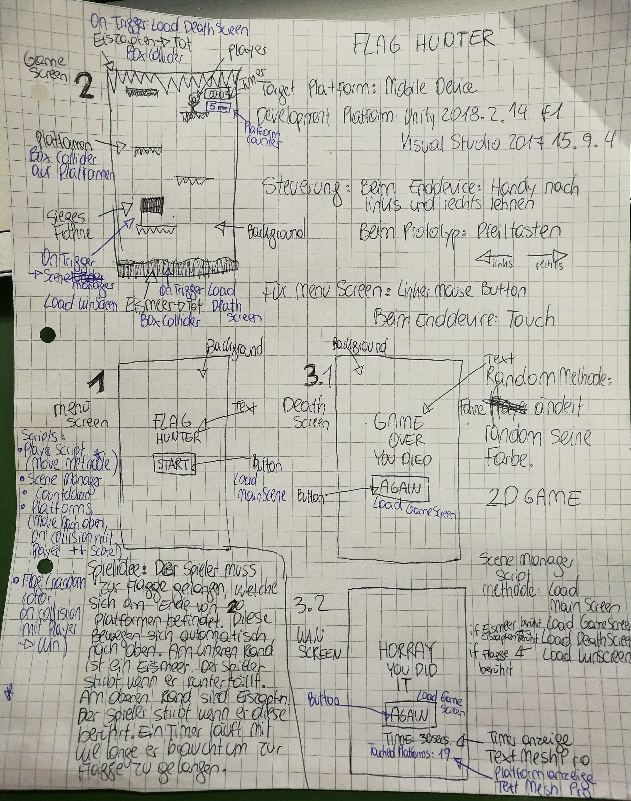
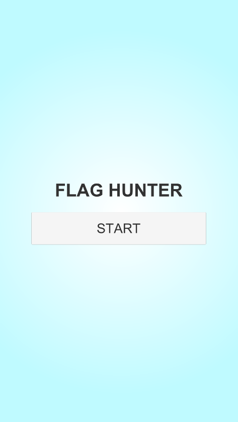
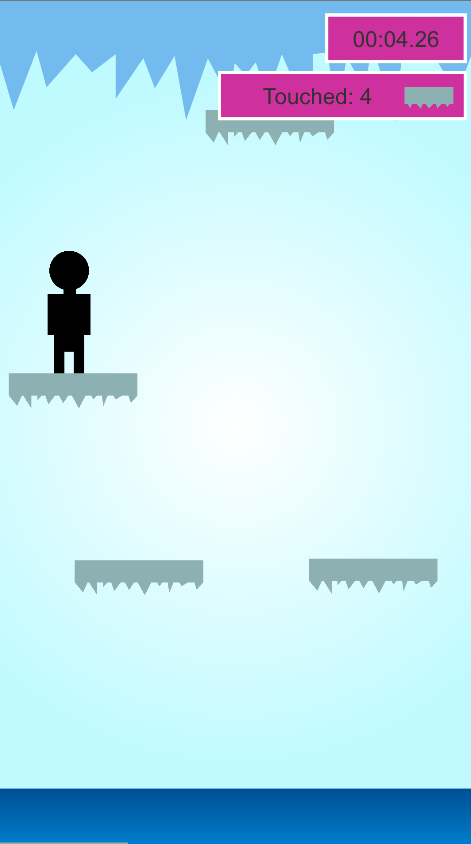
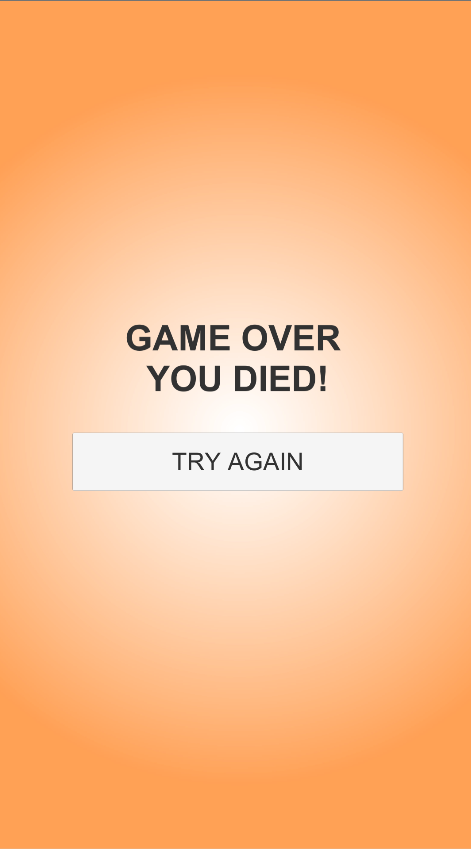
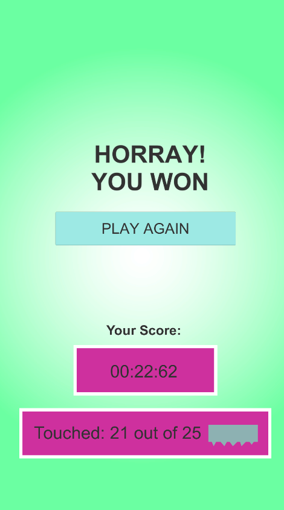

# FlagHunter
**Beschreibung des Spieles:**
Der Spieler muss zur Flagge gelangen (Durch links und rechts bewegen), welche sich am Ende von 25 Platformen befindet. Diese Bewegen sich automatisch nach oben. Der Spieler fällt nach unten auf die Platformen. Er darf nicht das Eismeer oder die Eiszapfen berühren.
Es handelt sich um ein 2D Game. 

**Development Platform:**
* Windows 10 
* Unity Version: 2018.2.14 f1 
* Visual Studio Version: 2017 15.9.4
* Scripting Runtime Version: .NET 3.5 Equivalent
* API compatibility Level: .NET 2.0 Subset

**Target Platform:**
* Für die weiterführende Version: Mobile Device (Reference Resolution: 1080*1920 px)
* Für diese "Testversion": Standalone (Reference Resolution: 1080*1920 px)

**Steuerung:**
* Für die weiterführende mobile Version: Neigung des Bildschirms und Touch für die Menüauswahl
* Für diese "Testversion": Pfeil Tasten (rechte & linke Pfeiltaste) und rechte Maustaste für die Menüauswahl

**Ressourcen für dieses Spiel:**
* Visuals: selbstgemacht, frei verwendbar für jede/n
* Code Timer: angelehnt an Code von Carolin Hollweger https://github.com/CarolinHollweger/CrackIn/blob/master/CrackIn/Assets/Scripts/StopWatch.cs
* Code Score: https://www.youtube.com/watch?v=QbqnDbexrCw
* Code Random Flag Color: angelehnt an Code von Susanne Meerwald-Stadler https://github.com/HS-Teaching/smeerwsRandomness/blob/master/Assets/MyGame/Scripts/Updater.cs

**Aktueller Stand:** 100% fertig

**Lessons Learned:**
* Werte in andere Scenes ausgeben mithilfe von Scriptable Objects
* Random Funktion der Änderung von Farben

**Limitations:** 
Bis jetzt exestiert nur ein Level (wie auch geplant). Deswegen befinden sich die Platformen immer auf den gleichen Positionen bei jedem Spieldurchlauf. 

**Konzept**

**Start Screen**

**Game Screen**

**Game Over Screen**

**Win Screen**

**official Trailer:** https://youtu.be/XKk6o-OMVx8

**copyright by Clea Eliasch**